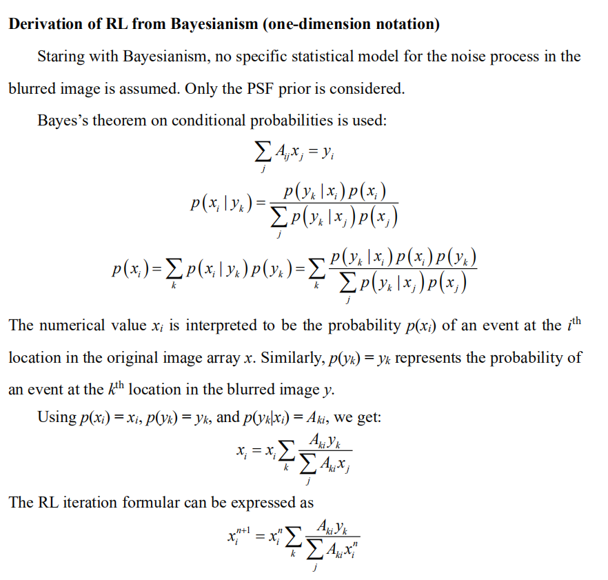
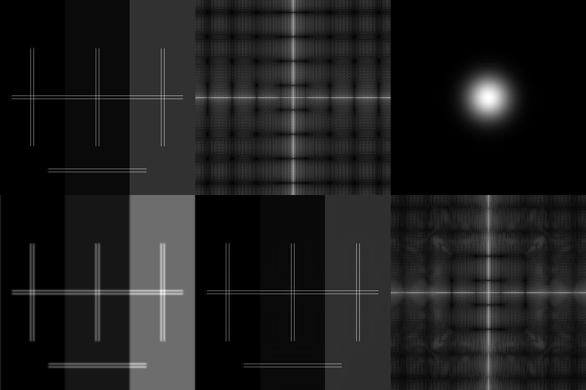
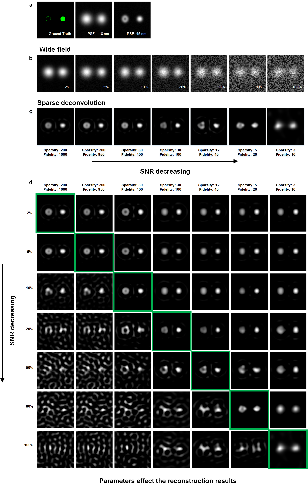

 

<h2 align="center">A small blog about deconvolution and machine learning</h2>

  

<h3 align="center">
The <a href="https://weisongzhao.github.io/rl_positivity_sim/">web version</a> of this blog is recommended.
</h3>

Inspired by the idea of [Andrew](https://twitter.com/AndrewGYork) for the scientific discussions on GitHub, I post a GitHub page to have an open discussion on the deconvolution topic, all opinions are my own and may not be right.

Please just leave a message on [Twitter](https://twitter.com/weisong_zhao/status/1370308101690118146)/[GitHub-issue](https://github.com/WeisongZhao/rl_positivity_sim/issues/new) if you are interested. 

## Inverse problem

First, I intend to talk about a little background of the `inverse problem` and `deconvolution`.

For me, the `deconvolution` is actually a `classical machine learning` method, rather than an `optical method`, that estimate the hidden parameter (real signal) from the measured parameter (camera image). 

<h4 align="center"> Ax = y. It is an inverse problem if without noise.  Ax + n = y. It is an ill-posed inverse problem if with noise.</h4>

What we're doing is trying to estimate the maximum possible `x` from the observed data `y`. If the `A` is a gaussian-function/point-source, and under **noise-free condition**, the `x` and `y` can be one–to–one correspondence.

In the machine learning or convex optimization field, before establishing a model, we always start by asking ourselves, is this problem convex, or is there existing a global optimum. If there is no noise, then the `x` and `y` can be **one–to–one correspondence**. No matter what method we use, we just need to find `x` that `Ax is absolutely equal to y`. 

There are many solutions, including the `Bayesian-based Richardson-Lucy deconvolution`, which will be discussed below. 

If the computing power is sufficient, even **particle swarm (PSO)** or **genetic algorithm (GA)** are effective choices. We can define the `x` as the parameters to be optimized by GA/PSO, and the optimization will stop when find `x` for `Ax – y = 0`.

## Frequentism and Bayesianism for the Richardson-Lucy (RL) deconvolution

Lucy's RL article is the very first successful try on `applying machine learning to the optical imaging`. However, the logic used in the Lucy's article is very flexible, so it can be a little misleading in some cases. 

What I intend to do in this section is to give a small insight that RL is a branch of classical machine learning.

<h4 align="center">The history of RL is very interesting. In fact, for centuries, the Frequentism and the Bayesianism have been at odds. That seems to echo the debate that we have today about the applications of the machine learning on the optical imaging (also in the fields of biology, physics, and chemistry).</h4>

To summarize the differences: **Frequentism** considers probabilities to be related to frequencies of real or hypothetical events. **Bayesianism** considers probabilities to measure degrees of knowledge. **Frequentist** analyses generally proceed through use of point estimates and **maximum likelihood** approaches. 

Let's talk about the RL to show that difference in specific.

### Derivation of RL from Bayesianism (one-dimension notation)

### Derivation of RL from Frequentism (one-dimension notation)

The **Frequentism** and **Bayesianism** who were all the while "deadly rivals" came together completely at this moment.

## Perfect estimation under noise-free condition

In the section of `Inverse problem` we used the perspective from the field of convex optimization.

> What we're doing is trying to estimate the maximum possible `x` from the observed data `y`. If the `A` is a gaussian-function/point-source, and under **noise-free condition**, the `x` and `y` can be one–to–one correspondence. In the machine learning or convex optimization field, before establishing a model, we always start by asking ourselves, is this problem convex, is there a global optimal value. If there is no noise, then the `x` and `y` can be **one–to–one correspondence**. No matter what method we use, we just need to find `x` for `Ax` is absolutely equal to `y`. There are many solutions, including the `Bayesian-based Richardson-Lucy deconvolution`, which will be discussed below. If the computing power is sufficient, even **particle swarm (PSO)** or **genetic algorithm (GA)** are effective choices. We can define the `x` as the parameters to be optimized by GA/PSO, and the optimization will stop when find `x` for `Ax – y = 0`.

In addition to the above explanation: the `x` and `y` are one–to–one correspondence, or the global optimization existence.

There is another explanation: 
The `MLE` is asymptotically unbiased when the amount of data grows. No noise condition can be considered as collecting `infinite number of photons` in the field of optical imaging, which is equal to the infinite data, so the MLE is unbiased. In addition, the infinite number of photons will be corresponding to zero variance of estimation. That means the perfect estimation of `x`.

This should be somehow corresponding to the widely accepted point in the field of `single molecule localization`. 

## Small simulations

<h3 align="center">RL under noise-free condition</h3>

 

Adapted from [James](https://github.com/jdmanton/rl_positivity_sim)'s simulation, we do the RL under noise-free condition for a better illustration. 

[HERE](https://github.com/WeisongZhao/rl_positivity_sim/blob/master/rl_positivity_sim.m) is the code to generate the following image.

It is worth noticing that, the rates of convergence for the areas with and without background are different. More iterations (now is `5k`, may be `200k` is sufficient) may lead to shorter distance to the ground-truth. 

In addition, current RL is a pratical form, e.g., using fast Fourier transform (FFT) instead of convolution in space; replace near-zero value to a larger one to avoid mistake; accelerated iteration. That will introduce some small corrugate artifacts in the deconvolution results.

## Prior knowledge

From a **Bayesian perspective**, introducing additional reasonable prior knowledge will make the estimation for small data (small photon number, small OTF support) more effective.

Considering the image contained background noise, like the configurations in [James](https://github.com/jdmanton/rl_positivity_sim)'s code, if corresponding to MLE, RL only considers Poisson noise, while Poisson noise does not contain background. So, the RL model seems to be deviating from the range of application (the image with background). 

So it would be a good correction/prior-knowledge to add `b` to the model based on this definition.

Of course, it is extremely complex in real world, including Gaussian-Poisson noise, background noise, defocus signal, cytosol signal, and limited sampling (pixel-size).

The regularization function is necessary for obtaining a unique solution in under-constrained systems.

<h4 align="center">argmin{L(x, y) + &lambda;R(x)},</h4>

where `x` is the reconstructed image, `L(·,·)` is the data fitting loss between the measured data and the forward model prediction, `R(·)` is a regularization function on the image, and `λ` is the hyper-parameter balancing the data fitting loss and the regularization term.

It is always a good way to add the corresponding prior knowledge to power the estimation. This word may be not restricting to deconvolution but all the algorithms.

Taken an example of single molecular localization microscopy (SMLM), which can also be treated as a `deconvolution` method, it utilizes the strongest prior knowledge on the real fluorescent signal `x`, i.e., the isolate puncta, to achieve super-resolution in 10~20 times. However, the usage of such prior knowledge needs the specific designed experiment, and can not be applied to the conventional microscopes.

What we intend to do is to find the relatively weak but general (for fluorescence imaging) prior-knowledge in the [manuscript](https://www.researchsquare.com/article/rs-279271/v1), 

- PSF is the important prior knowledge, the soul of `deconvolution`.
- Low frequency background, corresponding to cytosol signal and constant background. This is an optional priori knowledge.

Before moving on to our most important prior knowledge, I intend to say that in the field of machine learning, loss functions are the soul of the methods. This is also the basis for judging whether the prior knowledge is effective. Whether the desired effect [increased resolution in deconvolution] can reduce the loss function with prior knowledge added. If it does, it's effective for this objective

- Sparsity, we used the `L1 norm` (the sum of the absolute values of all the elements).

From the forward model of fluorescence imaging, a smaller PSF convolution corresponds to a smaller `L1 norm` loss function. At least if the forward model of fluorescence imaging is satisfied, then this prior is reasonable.

- Continuity, we used the `Hessian matrix norm` (the sum of the absolute values of the second order derivative). The notation is `[1 -2 1]` as in `x` direction.

The PSF of images must occupy more than `3 × 3 pixels` in space which constitutes the basis for the continuity. At least if the Nyquist sampling criteria of images is satisfied, then this prior is reasonable.

Thus, `sparsity` recovers the high frequency information (towards to the real signal), and in the meantime the image is also constrained by the `Hessian matrix continuity`. As these priors on two different levels recovering the signal cooperatively, the proposed sparse deconvolution is more robust and effective.

[HERE](https://www.researchsquare.com/article/rs-279271/v1) can find more details and results of the sparse deconvolution.

SEE also my [website](https://weisongzhao.github.io/MyWeb2/portfolio-4-col.html).

## Summary and outlook 
Admittedly, the reasonable usage of prior knowledge is a prerequisite for the method to really apply to the biological applications. Unreasonable parameters do lead to less-than-ideal results.
- For example, infinitely increasing the parameter of sparsity will turn the whole picture into zero. The loss function will be equal to the `L1 norm` only.
- See also the following specific simulation example:

> **Simulations under different SNR, and the corresponding reconstruction results.** (**a**) We created synthetic ring-shaped and punctated structures with an 80 nm diameter as ground-truth (left). It was convolved with PSF with FWHM of either 110 nm (middle) or 45 nm (right). (**b**) These images were subsequently subsampled 16 times (pixel sizes of 16 nm), and corrupted with Poisson noise and `2%, 5%, 10%, 20%, 50%, 80%, and 100%` Gaussian noise. (**c**) The images with different Gaussian noise amplitudes are processed with different weights of priors. (**d**) The 7 × 7 table of the reconstruction results. The column, and row represent the noise amplitude and weights of priors for reconstruction, respectively. 

Although it still has its disadvantages (hard to use), I believe that [sparse deconvolution](https://www.researchsquare.com/article/rs-279271/v1) is currently the best and the most effective solution/method. Under a broader perspective, this is probably the TOP method of generative models in the field of unsupervised learning (including deep or non-deep methods) for fluorescence image restoration.

All technologies have its boundaries, and using `proof by contradiction` to evaluate them may be not appropriate. The success is success, the unsuccessful example will only illustrate the boundary of the technology. Just as all microscopes are suitable for imaging only a certain range of samples.

The unrestricted using and testing can lead to the strange results. But we are eager for the community to test it extensively, and exploring the boundaries of this method, which will also give us or other developers the opportunity to push the algorithm limit further.

## Outreach and feedback

<h4  id="Doug" align="center">
FROM <a href="https://twitter.com/DougPShepherd">Doug Shepherd</a>.
</h4>

As point out by <a href="https://twitter.com/DougPShepherd">Doug</a>
<blockquote>The ad hoc choice of parameters is part of what I am confused on. A correct Bayesian treatment would provide error bars and allow you to address the model selection problem that you are side-stepping.</blockquote>

Though it may be a bit off-topic, it is true that deconvolution (MLE, MAP) and feed-forward deep learning approaches for inverse problems typically focus on recovering a point estimate without quantifying the uncertainty.  

The uncertainty estimation is actually an open question, and I thought that there exists no golden standard for all cases.  

In a Bayesian framework, this problem could be addressed by accurately modeling the measurement noise, formulating an estimation problem, and computing the posterior distribution of the hidden image. However, this analytical approach is only tractable in simple cases. When the inverse problem is non-convex, <b>in high-dimension</b> or the measurement noise is complicated (e.g., non-Gaussian) the posterior distribution can quickly become intractable to compute analytically.  
Additionally, in this <a href="https://www.nature.com/articles/s43586-020-00001-2">review</a> <b>Bayesian statistics and modelling</b> they propose a new cheklist <b>WAMBS-v2</b> to correct the model back and forth: 
<blockquote> WAMBS-v2, an updated version of the WAMBS (when to Worry and how to Avoid the Misuse of Bayesian Statistics) checklist.</blockquote>

But I thought this checklist may be not so suitable for the problem in image restoration. 

On the other hand, the <b>Bayesian neural networks</b> is popular recently and may be a good choice (the concept) to quantify uncertainty. In addition <b>Bayesian neural networks</b> also splits the uncertainty to the <b>model uncertainty</b> and <b>data uncertainty</b>.  

The map has been explored bit by bit, now is indeed a good opportunity for the developers to solve/understand the illed-posed inverse problem futher. By now, the <a href="https://www.researchsquare.com/article/rs-279271/v1">sparse deconvolution</a> still depends on the "human-eye checklisk" and I wish that I and my colleagues, and other developers could somehow moderate this imperfection in the future. 

## Statement 
All opinions are just my own and some content of this blog could be wrong or biased. If someone has a better explanation about this topic #deconvolution, please do let me know using [Twitter](https://twitter.com/weisong_zhao/status/1370308101690118146)/[GitHub-issue](https://github.com/WeisongZhao/rl_positivity_sim/issues/new).

## REFERENCES
[1] Lucy, L.. “An iterative technique for the rectification of observed distributions.” The Astronomical Journal 79 (1974): 745-754. 
[2] Carasso, A.. “Linear and Nonlinear Image Deblurring: A Documented Study.” SIAM Journal on Numerical Analysis 36 (1999): 1659-1689. 
[3] VanderPlas, Jake. "Frequentism and bayesianism: a python-driven primer." arXiv preprint arXiv:1411.5018 (2014). 
[4] [Zhao, Weisong, et al. "Extending resolution of structured illumination microscopy with sparse deconvolution." (2021).](https://www.researchsquare.com/article/rs-279271/v1)

## TALK ON Twitter 
<h3 align="center">
Please see the <a href="https://weisongzhao.github.io/rl_positivity_sim/">web version</a>
</h3>

<blockquote class="twitter-tweet">
Good point! You may want to see the Supplementary Fig. 2, and Supplementary Fig. 7 in our manuscript. It is the two-line structure though. <a href="https://t.co/3WB3m7Ptsw">https://t.co/3WB3m7Ptsw</a> <a href="https://t.co/qaGCJERkjg">pic.twitter.com/qaGCJERkjg</a>
&mdash; Weisong Zhao (@weisong_zhao) <a href="https://twitter.com/weisong_zhao/status/1370356303604842499?ref_src=twsrc%5Etfw">March 12, 2021</a></blockquote> 

<blockquote class="twitter-tweet">
I agree with that it would be a little hard to understand if start with the SIM system. I think that start with the conventional wide-field microscopy could be easier?  [1/n]
&mdash; Weisong Zhao (@weisong_zhao) <a href="https://twitter.com/weisong_zhao/status/1370407748597256197?ref_src=twsrc%5Etfw">March 12, 2021</a></blockquote> 
<blockquote class="twitter-tweet">
But if from a broader view, we can start from the Bayesian framework and transform it to the MAP estimation -&gt; maximum P(y|x)*P_L1(x)*P_Hessian(y). Then we use the Split-Bregman to minimize the -log{P(y|x) *P_L1(x)*P_Hessian(y)}.  [3/n]
&mdash; Weisong Zhao (@weisong_zhao) <a href="https://twitter.com/weisong_zhao/status/1370407862757814279?ref_src=twsrc%5Etfw">March 12, 2021</a></blockquote> 
<blockquote class="twitter-tweet">
We minimize the {Loss_{Ax-y} + a * Loss_L1} together, and with an ad-hoc reasonable value of parameter a, the reconstruction will be more effective.  [5/n]
&mdash; Weisong Zhao (@weisong_zhao) <a href="https://twitter.com/weisong_zhao/status/1370408007033446406?ref_src=twsrc%5Etfw">March 12, 2021</a></blockquote> 
<blockquote class="twitter-tweet">
Currently, there is no analytic-theory to guide people to choose the best regularization parameters. We have to introduce the human-eye-prior to choose the parameters back and forth.  [7/n]
&mdash; Weisong Zhao (@weisong_zhao) <a href="https://twitter.com/weisong_zhao/status/1370408144824770565?ref_src=twsrc%5Etfw">March 12, 2021</a></blockquote> 
<blockquote class="twitter-tweet">
I think the best parameters, a and b, somehow have a relationship as descripted in the manuscript, and they should be related to the SNR and the sample itself. [8/n]
&mdash; Weisong Zhao (@weisong_zhao) <a href="https://twitter.com/weisong_zhao/status/1370408216006250496?ref_src=twsrc%5Etfw">March 12, 2021</a></blockquote> 
<blockquote class="twitter-tweet">
Thank you too, I&#39;m looking forword to your detailed reply!
&mdash; Weisong Zhao (@weisong_zhao) <a href="https://twitter.com/weisong_zhao/status/1370412561900826628?ref_src=twsrc%5Etfw">March 12, 2021</a></blockquote> 

