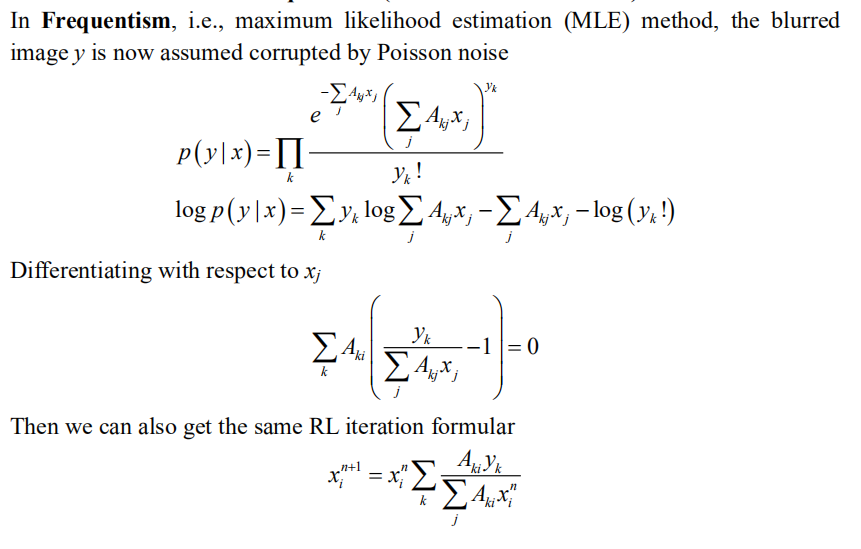

 

<h2 align="center">A small blog about deconvolution and machine learning</h2>

  

Inspired by the idea of [Andrew](https://twitter.com/AndrewGYork) for the scientific discussions on GitHub, I post a GitHub page to have an open discussion on the deconvolution topic, all opinions are my own and may not be right.

Please just leave a message on [Twitter](https://twitter.com/weisong_zhao)/[GitHub-issue](https://github.com/WeisongZhao/rl_positivity_sim/issues/new) if you are interested. 

## Inverse problem

First, I intend to talk about a little background of the `inverse problem` and `deconvolution`.

To me, the `deconvolution` is actually a `classical machine learning` method but not an `optical method`, that estimate the hidden parameter (real signal) from the measured parameter (camera image). 

<h4 align="center"> Ax = y. It is an inverse problem if without noise.  Ax + n = y. It is an ill-posed inverse problem if with noise</h4>

What we're doing is trying to estimate the maximum possible `x` from the observed data `y`. If the `A` is a gaussian-function/point-source, and under **noise-free condition**, the `x` and `y` can be one–to–one correspondence.

In the machine learning or convex optimization field, before establishing a model, we always start by asking ourselves, is this problem convex, is there a global optimal value. If there is no noise, then the `x` and `y` can be **one–to–one correspondence**. No matter what method we use, we just need to find `x` for `Ax` is absolutely equal to `y`. 

There are many solutions, including the `Bayesian-based Richardson-Lucy deconvolution`, which will be discussed below. 

If the computing power is sufficient, even **particle swarm (PSO)** or **genetic algorithm (GA)** are effective choices. We can define the `x` as the parameters to be optimized by GA/PSO, and the optimization will stop when find `x` for `Ax – y = 0`.

## Frequentism and Bayesianism for the Richardson-Lucy (RL) deconvolution

Lucy's RL article is the very first successful try on machine learning applying to the optical imaging. However, the logic used in the Lucy's article is very flexible, so it can be a little misleading in some cases. 

What I intend to do in this section is to give a small insight that RL is a branch of classical machine learning.

<h4 align="center">The history of RL is very interesting. In fact, for centuries, the Frequentism and the Bayesianism have been at odds, and that seems to echo the debate that we have today about the applications of the machine learning on the optical imaging (also in the fields of biology, physics, and chemistry).</h4>

To summarize the differences: **Frequentism** considers probabilities to be related to frequencies of real or hypothetical events. **Bayesianism** considers probabilities to measure degrees of knowledge. **Frequentist** analyses generally proceed through use of point estimates and **maximum likelihood** approaches. 

Let's talk about the RL to show that difference in specific.

### Derivation of RL from Bayesianism (one-dimension notation)

### Derivation of RL from Frequentism (one-dimension notation)

The **Frequentism** and **Bayesianism** who were all the while "deadly rivals" came together completely at this moment.

## Perfect estimation under noise-free condition

In the section of `Inverse problem` we used the perspective from the field of convex optimization.

> What we're doing is trying to estimate the maximum possible `x` from the observed data `y`. If the `A` is a gaussian-function/point-source, and under **noise-free condition**, the `x` and `y` can be one–to–one correspondence. In the machine learning or convex optimization field, before establishing a model, we always start by asking ourselves, is this problem convex, is there a global optimal value. If there is no noise, then the `x` and `y` can be **one–to–one correspondence**. No matter what method we use, we just need to find `x` for `Ax` is absolutely equal to `y`. There are many solutions, including the `Bayesian-based Richardson-Lucy deconvolution`, which will be discussed below. If the computing power is sufficient, even **particle swarm (PSO)** or **genetic algorithm (GA)** are effective choices. We can define the `x` as the parameters to be optimized by GA/PSO, and the optimization will stop when find `x` for `Ax – y = 0`.

In addition to the above explanation: the `x` and `y` are one–to–one correspondence, or the global optimization existence.

There is another explanation: 
The `MLE` is asymptotically unbiased when the amount of data grows. No noise condition can be considered as collecting `infinite number of photons` in the field of optical imaging, which is equal to the infinite data, so the MLE is unbiased. In addition, the infinite number of photons will be corresponding to zero variance of estimation. That means the perfect estimation of `x`.

This should be somehow corresponding to the widely accepted point in the field of `single molecule localization`. 

## Small simulations

<h3 align="center">RL under noise-free condition</h3>

 

Adapted from [James](https://github.com/jdmanton/rl_positivity_sim)'s simulation, we do the RL under noise-free condition for a better illustration. 

[HERE](https://github.com/WeisongZhao/rl_positivity_sim/blob/master/rl_positivity_sim.m) is the code to generate the following image.

It is worth noticing that, the rates of convergence for the areas with and without background are different. More iterations (now is `5k`, may be `200k` is sufficient) may lead to shorter distance to the ground-truth. In addition, current RL is a pratical form, e.g., using fast Fourier transform (FFT) instead of convolution in space; replace near-zero value to a larger one to avoid mistake; accelerated iteration.

## Prior knowledge

From a **Bayesian perspective**, introducing additional reasonable prior knowledge will make the estimation for small data (small photon number, small OTF support) more effective.

Considering the image contained background noise, like the configurations in [James](https://github.com/jdmanton/rl_positivity_sim)'s code, if corresponding to MLE, RL only considers Poisson noise, while Poisson noise does not contain background. So, the RL model seems to be deviating from the range of application (the image with background). 

So it would be a good correction/prior-knowledge to add `b` to the model based on this definition.

Of course, the real world is very complex, including Gaussian-Poisson noise, background noise, defocus signal, cytosol signal, and limited sampling (pixel-size).

It is always a good way to add the corresponding prior knowledge to power the estimation. This word may be not restricting to deconvolution but all the algorithms.

Taken an example of single molecular localization microscopy (SMLM), which can also be treated as a `deconvolution` method, it utilizes the strongest prior knowledge on the real fluorescent signal `x`, i.e., the isolate puncta, to achieve super-resolution in 10~20 times. However, the usage of such prior knowledge needs the specific designed experiment, and can not be applied to the conventional microscopes.

What we intend to do is to find the relatively weak but general (for fluorescence imaging) prior-knowledge in the [manuscript](https://www.researchsquare.com/article/rs-279271/v1), 

- PSF is the important prior knowledge, the soul of `deconvolution`.
- Low frequency background, corresponding to cytosol signal and constant background. This is an optional priori knowledge.

Before moving on to our most important prior knowledge, I intend to say that in the field of machine learning, loss functions are the soul of the methods. This is also the basis for judging whether the prior knowledge is effective. Whether the desired effect [increased resolution in deconvolution] can reduce the loss function with prior knowledge added. If it does, it's effective for this objective

- Sparsity, we used the `L1 norm` (the sum of the absolute values of all the elements).

From the forward model of fluorescence imaging, a smaller PSF convolution corresponds to a smaller `L1 norm` loss function. At least if the forward model of fluorescence imaging is satisfied, then this prior is reasonable.

- Continuity, we used the `Hessian matrix norm` (the sum of the absolute values of the second order derivative). The notation is `[1 -2 1]` as in `x` direction.

The PSF of images must occupy more than `3 × 3 pixels` in space which constitutes the basis for the continuity. At least if the Nyquist sampling criteria of images is satisfied, then this prior is reasonable.

Thus, `sparsity` recovers the high frequency information (towards to the real signal), and in the meantime the image is also constrained by the `Hessian matrix continuity`. As these priors on two different levels recovering the signal cooperatively, the proposed sparse deconvolution is more robust and effective.

[HERE](https://www.researchsquare.com/article/rs-279271/v1) can find more details and results of the sparse deconvolution.

SEE also my [website](https://weisongzhao.github.io/MyWeb2/portfolio-4-col.html).

## Summary and outlook 
Admittedly, the reasonable usage of prior knowledge is a prerequisite for the method to really apply to the biological applications. Unreasonable parameters do lead to less-than-ideal results.
- For example, infinitely increasing the parameter of sparsity will turn the whole picture into zero. The loss function will be equal to the `L1 norm` only.

Although it still has its disadvantages (hard to use), I believe that [sparse deconvolution](https://www.researchsquare.com/article/rs-279271/v1) is currently the best and the most effective solution/method. Under a broader perspective, this is probably the TOP generative model in the field of unsupervised learning (including deep or non-deep models) for image restoration of fluorescence microscopy.

All technologies have its boundary, and they are not suitable for using proof by contradiction. The successful example is the success, the unsuccessful example only illustrates the boundary of the technology. Just as all microscopes are suitable for imaging only a certain range of samples.

Unrestricted using and testing can certainly lead to strange results. But we were eager for the community to test it extensively, and exploring the boundaries of the method gave us and the other developers the opportunity to push the algorithm further.

## REFERENCES
[1] Lucy, L.. “An iterative technique for the rectification of observed distributions.” The Astronomical Journal 79 (1974): 745-754. 
[2] Carasso, A.. “Linear and Nonlinear Image Deblurring: A Documented Study.” SIAM Journal on Numerical Analysis 36 (1999): 1659-1689. 
[3] VanderPlas, Jake. "Frequentism and bayesianism: a python-driven primer." arXiv preprint arXiv:1411.5018 (2014). 
[4] [Zhao, Weisong, et al. "Extending resolution of structured illumination microscopy with sparse deconvolution." (2021).](https://www.researchsquare.com/article/rs-279271/v1)