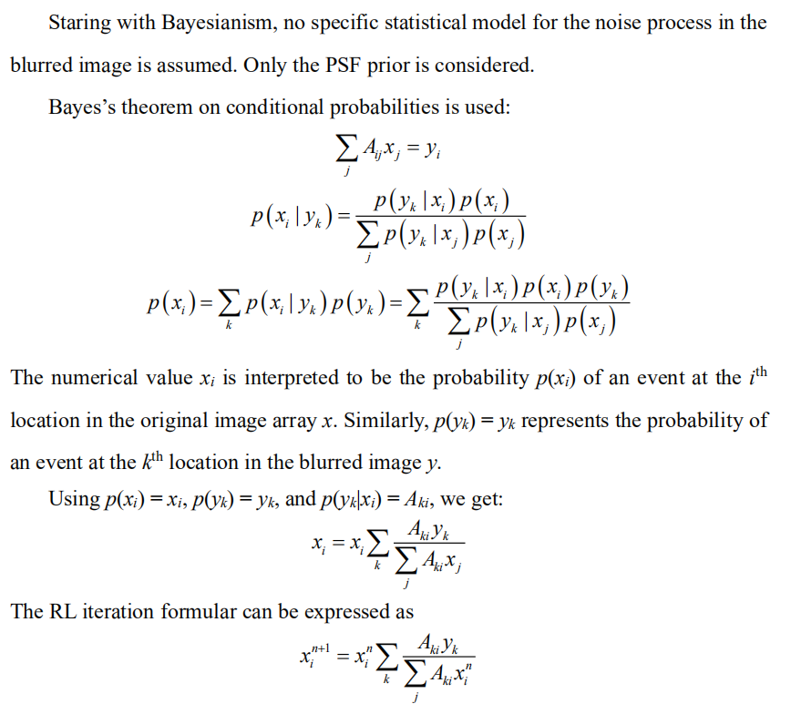

Inspired by great idea of [Andrew](https://twitter.com/AndrewGYork), I open a GitHub page to have an open discussion on the deconvolution topic, all opinions are my own and may not be right.

Please just leave a message on [Twitter](https://twitter.com/weisong_zhao)/[GitHub-issue](https://github.com/WeisongZhao/rl_positivity_sim/issues/new) if you are interested. 

## Inverse problem

First, I intend to talk about a little background of the `inverse problem` and `deconvolution`.

To me, the `deconvolution` is actually a `classical machine learning` method but not an `optics method`, that estimate the hidden parameter (real signal) from the measured parameter (camera image). 

<h4 align="center"> Ax = y. It is an inverse problem if without noise.  Ax + n = y. It is an ill-posed inverse problem if with noise</h4>

What we're doing is trying to estimate the maximum possible `x` from the observed data `y`. If the `A` is a gaussian function, point source, and in noise-free condition, so the `x` and y are one–to–one correspondence.

In the machine learning or convex optimization field, we always start by asking ourselves, is this problem convex, is there a global optimal value. If there is no noise, then the `x` and `y` can be **one–to–one correspondence**. No matter what method we use, we just need to find `Ax` that is absolutely equal to `y`. 

There are many solutions, including the Bayesian-based Richardson-Lucy deconvolution, which will be discussed below. If the computing power is sufficient, even **particle swarm (PSO)** or **genetic algorithm (GA)** are effective choices. We can define the x is the parameters to be optimized for GA/PSO, and the optimization will stop when find `x` for `Ax – y = 0`.

## Frequentism and Bayesianism for the Richardson-Lucy (RL) deconvolution

Lucy's RL article is the very first successful try on machine learning applying to the optical imaging. However, the logic used in the Lucy's article is very flexible, so it can be a little misleading in some cases. 

What I intend to do in this section is to give a small insight that RL is a branch of classical machine learning.

The history of RL is very interesting. In fact, for centuries, the **Frequentism** and the **Bayesianism** have been at odds, and that seems to echo the debate that we have today about the applications of the machine learning on the optical imaging.

To summarize the differences: **Frequentism** considers probabilities to be related to frequencies of real or hypothetical events. **Bayesianism** considers probabilities to measure degrees of knowledge. **Frequentist** analyses generally proceed through use of point estimates and **maximum likelihood** approaches. 

That talk about the RL to show that difference in specific.

### Derivation of RL from Bayesianism (one-dimension notation)

### Derivation of RL from Frequentism (one-dimension notation)

The **Frequentism** and **Bayesianism** who were all the while "deadly rivals" came together completely at this moment.

## Perfect estimation under noise-free condition

In the section of `Inverse problem` we used the view from the field of convex optimization.

> What we're doing is trying to estimate the maximum possible `x` from the observed data `y`. If the `A` is a gaussian function, point source, and in noise-free condition, so the `x` and y are one–to–one correspondence.

In the machine learning or convex optimization field, we always start by asking ourselves, is this problem convex, is there a global optimal value. If there is no noise, then the `x` and `y` can be **one–to–one correspondence**. No matter what method we use, we just need to find `Ax` that is absolutely equal to `y`. 

There are many solutions, including the Bayesian-based Richardson-Lucy deconvolution, which will be discussed below. If the computing power is sufficient, even **particle swarm (PSO)** or **genetic algorithm (GA)** are effective choices. We can define the x is the parameters to be optimized for GA/PSO, and the optimization will stop when find `x` for `Ax – y = 0`.

In addition to the above explanation: the `x` and `y` are one–to–one correspondence, or the global optimization existence, 

There is another explanation: 
The MLE may not be unbiased with finite data. However, the `MLE` is asymptotically unbiased when the amount of data grows. 

No noise condition can be considered as collecting `infinite number of photons` in the field of optical imaging, which is equal to the infinite data, so the MLE is unbiased. In addition, the infinite number of photons will be corresponding to zero variance of estimation. That means the perfect estimation of `x`.

This should be somehow corresponding to the widely accepted point in the field of `single molecule localization`. 

## Prior knowledge

## Summary and outlook 